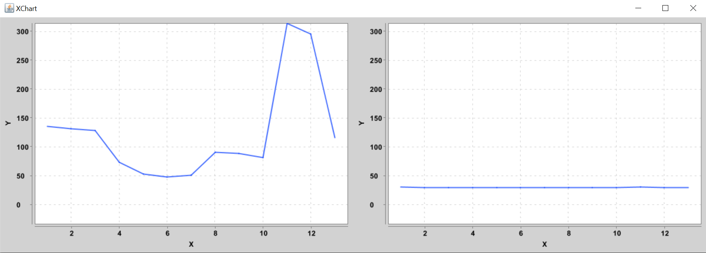

# Atividade prática com Arduino

## Objetivo:  
Desenvolver um projeto com Arduino, medir temperatura e luminosidade. Coletar através da interface serial (Usando o Javino) os valores e plotar um gráfico dos dados.

## Tecnologias:  
Java  7
C++ (Arduino)  

## Frameworks:  
Javino (Biblioteca Java e Arduino)  
Xchart (Geração dos gráficos)  

## Execução:  
* Carregar código para o Arduino
* Abrir main do código Java (Alterar porta para a porta que o Arduino está utilizando)
* Rodar main do código

## Gráfico gerado:  
